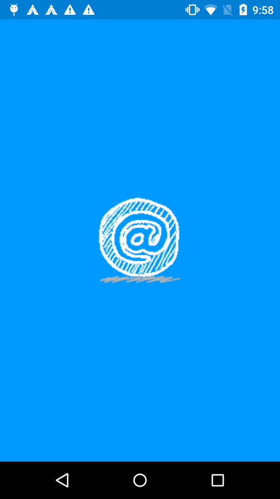
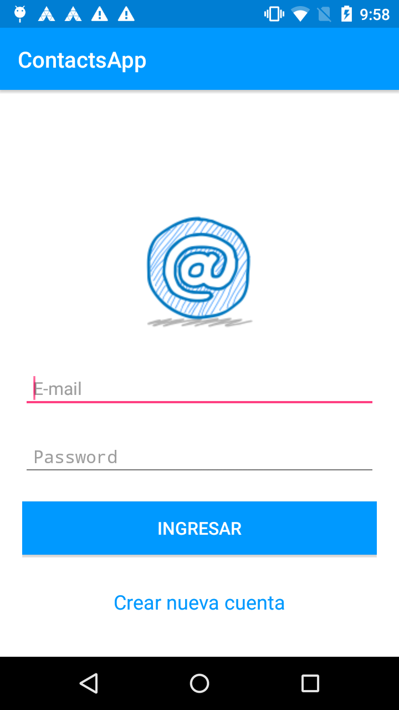
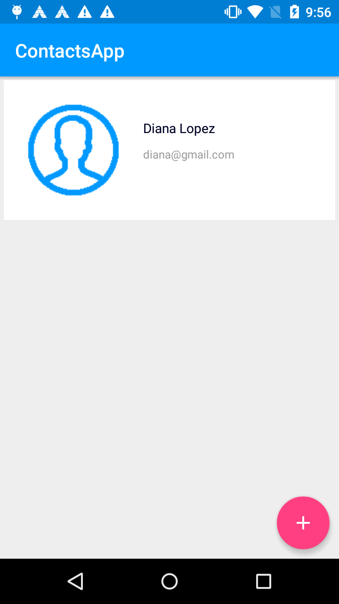
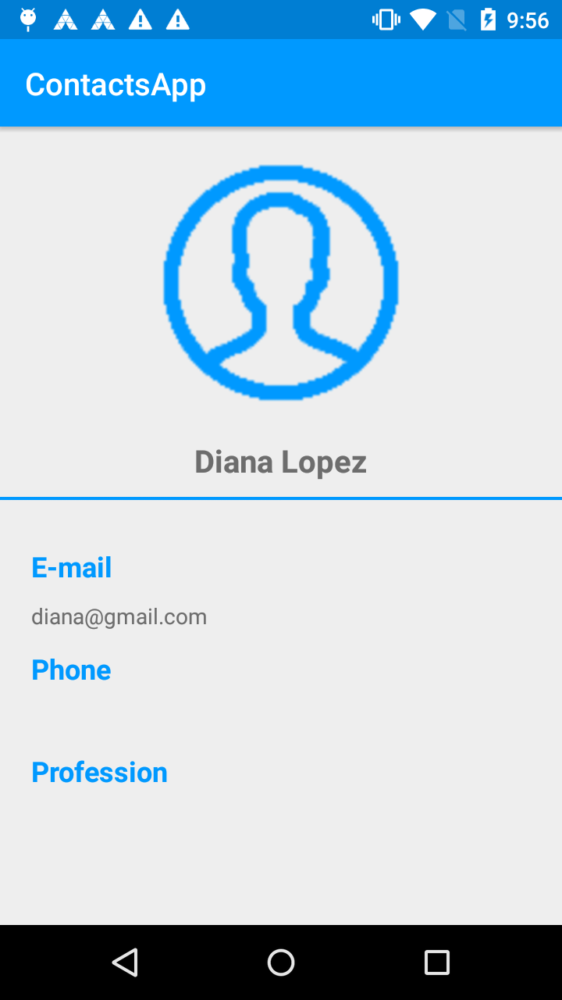
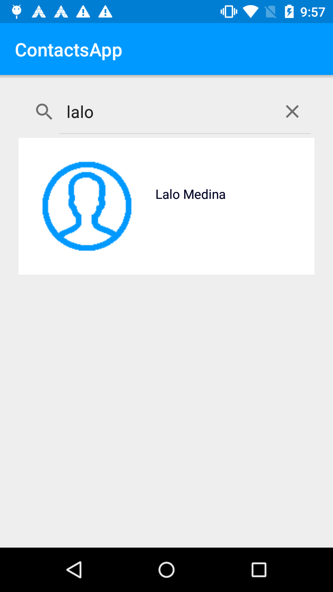
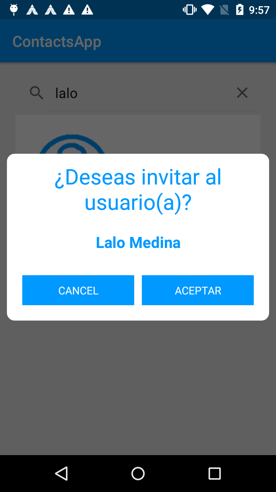

# Reto-Kotlin
Reto Kotlin - Construye tu primera App Android en Kotlin https://devexperto.com/training-gratuito/

# Aplicación

*ContactsApp*

 

 

 

## Referencias

- Iconos https://www.iconfinder.com/

- Diseño http://materialdesignblog.com/glide-for-android-finally-gets-material-design-makeover/

- Material icons https://materialdesignicons.com/

- Backendless Rest API https://backendless.com/documentation/data/rest/data_overview.htm
